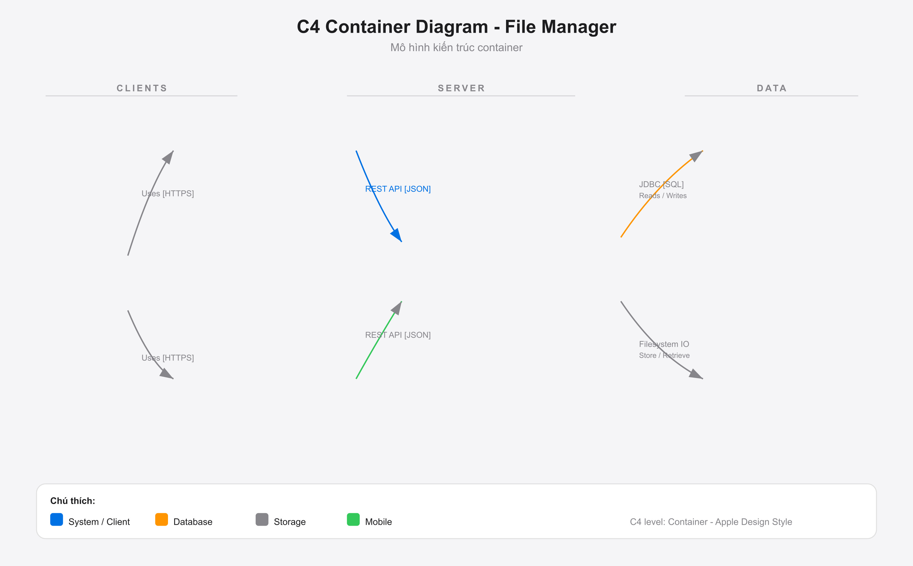

# File Manager — Hệ thống quản lý file hiện đại

## 🎯 Giới thiệu

**File Manager** là nền tảng quản lý file toàn diện với kiến trúc đa tầng: **Spring Boot + Jersey REST API** (backend), **Angular 21 SSR** (web frontend), và **Android native** (mobile). Thiết kế theo phong cách Apple Design, hệ thống hỗ trợ upload/download, chia sẻ file an toàn, quản lý quota, thông báo real-time qua SSE, và dashboard quản trị.

---

## ✨ Tính năng nổi bật

| Tính năng | Mô tả |
|-----------|-------|
| **📤 Upload / Download** | Hỗ trợ đa định dạng file, lưu trữ trên local filesystem |
| **🔗 Chia sẻ file an toàn** | Tạo share link với JWT-based authentication |
| **📊 Quota thông minh** | Giới hạn dung lượng lưu trữ theo từng user |
| **🔔 Thông báo real-time** | Push notification qua SSE (Server-Sent Events) |
| **🗑️ Thùng rác tự động** | Tự động cleanup files theo lịch trình |
| **🛡️ Bảo mật đa tầng** | JWT authentication + Angular Route Guards + Server-side validation |
| **📈 Admin Dashboard** | Quản lý users, files, upgrade requests |
| **📱 Đa nền tảng** | Web (Angular SSR) + Mobile (Android native) |

---

## 🏗️ Kiến trúc hệ thống

### C4 Container Diagram



*Sơ đồ kiến trúc C4 ở mức Container — thể hiện các container chính và luồng tương tác.*

### Giải thích luồng dữ liệu

| Luồng | Giao thức | Mô tả |
|-------|-----------|-------|
| User → Angular SPA | HTTPS | Người dùng truy cập web app qua trình duyệt |
| User → Android App | HTTPS | Người dùng sử dụng mobile app |
| Angular SPA → Spring Boot API | JSON/HTTPS | REST API calls từ frontend |
| Android App → Spring Boot API | JSON/HTTPS | REST API calls từ mobile app |
| Spring Boot API → MySQL/H2 | JDBC/SQL | Truy vấn dữ liệu người dùng, file, share links |
| Spring Boot API → File Storage | Filesystem IO | Lưu trữ và truy xuất file uploaded |

### Sơ đồ project

```
file-manager/
├── backend/                     # Spring Boot + Jersey REST API
│   └── src/main/java/com/filemanager/
│       ├── config/              # JerseyConfig, SecurityConfig
│       ├── entity/              # User, FileMetadata, FileShare...
│       ├── repository/          # Spring Data JPA repositories
│       ├── resource/            # REST endpoints (JAX-RS)
│       ├── service/             # Business logic layer
│       ├── security/            # JWT utilities
│       └── exception/           # Global error handling
├── frontend/                    # Angular 21 SPA + SSR
│   └── src/app/
│       ├── core/                # Guards, interceptors, shared services
│       └── features/
│           ├── auth/            # Login / Register
│           ├── files/           # File list, upload, trash, shared
│           ├── notification/    # SSE notification bell
│           ├── admin/           # Admin dashboard
│           └── account/         # Account settings
├── android/                     # Android native app (Java)
├── docs/                        # Documentation & plans
│   └── images/                  # Architecture diagrams & screenshots
├── uploads/                     # Local filesystem storage
└── AGENTS.md                    # AI Agent instructions
```

---

## 🛡️ Bảo mật & Phân quyền

- **JWT Authentication (24h expiry):** Token chứa `role` claim, phân quyền trực tiếp.
- **Angular Route Guards:**
  - `authGuard`: Chặn người dùng chưa đăng nhập, tự động lưu `returnUrl`.
  - `noAuthGuard`: Chặn người đã đăng nhập vào `/login`, `/register`.
  - `adminGuard`: Giải mã JWT kiểm tra quyền `ADMIN`, đẩy về `/files` kèm cảnh báo nếu không có quyền.
- **Server-side validation:** Mọi endpoint `/api/admin/*` đều dùng helper `isAdmin()` đối chiếu ID với CSDL.
- **Input validation:** Xác thực dữ liệu ở cả client (Reactive Forms) và server.
- **SQL Injection protection:** Spring Data JPA + Hibernate.
- **Case-insensitive unique:** Bảo vệ trùng email/username không phân biệt hoa-thường.

---

## 📖 API Endpoints

| Method | Endpoint | Description | Auth |
|--------|----------|-------------|------|
| `POST` | `/api/auth/register` | Đăng ký user | No |
| `POST` | `/api/auth/login` | Đăng nhập, trả JWT | No |
| `GET` | `/api/files` | Danh sách files | Yes |
| `POST` | `/api/files/upload` | Upload file | Yes |
| `POST` | `/api/files/share` | Tạo share link | Yes |
| `DELETE` | `/api/files/{id}` | Xóa file (vào thùng rác) | Yes |
| `GET` | `/api/notifications` | Lấy notifications | Yes |
| `GET` | `/api/admin/users` | Quản lý users (Admin) | Admin |

---

## 🚀 Developer Guide

### Yêu cầu hệ thống

- **Java 17+** (Backend)
- **Node.js 20+** (Frontend)
- **MySQL 8+** (tùy chọn, có thể dùng H2 embedded để test)
- **Android Studio** (cho mobile app)

### 1. Backend (Spring Boot)

```bash
cd backend
mvn clean install
mvn spring-boot:run
```

**API chạy tại:** `http://localhost:8080/api`

**H2 Console (test nhanh):** `http://localhost:8080/h2-console`

### 2. Frontend (Angular)

```bash
cd frontend
npm install
npm run start
```

> **Note:** Cần chạy `npm install` trước. Nếu dùng SSR, chạy `npm run serve:ssr`.

**App chạy tại:** `http://localhost:4200`

### 3. Database (MySQL — tùy chọn)

```sql
CREATE DATABASE file_manager_db;
```

Cập nhật thông tin kết nối trong `backend/src/main/resources/application.properties`:

```properties
spring.datasource.url=jdbc:mysql://localhost:3306/file_manager_db
spring.datasource.username=root
spring.datasource.password=your_password
```

> **Mặc định:** H2 embedded database được cấu hình sẵn, không cần MySQL để chạy thử.

### 4. Chạy Fullstack

```bash
# Terminal 1: Backend
cd backend && mvn spring-boot:run

# Terminal 2: Frontend
cd frontend && ng serve

# Browser: http://localhost:4200
```

### 5. Android App

Mở thư mục `android/` bằng Android Studio, sync Gradle và chạy trên emulator hoặc thiết bị thật. Cấu hình `BASE_URL` trong code để trỏ tới backend API.

---

## 📈 Performance

- **Backend:** Spring Boot optimized, HikariCP connection pool
- **Frontend:** Angular SSR, lazy loading modules, signal-based reactivity
- **Storage:** Local filesystem tại `uploads/`
- **Database:** Index trên `user_id`, `parent_id`, `deleted_at`

---

## 🎨 Design System

- **Typography:** SF Pro (Display/Text) với optical sizing
- **Colors:** Apple Blue (`#0071e3`) + Monochrome (`#f5f5f7` / `#1d1d1f`)
- **Spacing:** 8px base system
- **Shadows:** Soft diffused (`rgba(0,0,0,0.22)`)
- **Responsive:** Mobile-first (360px → 1440px+)

Xem chi tiết: [apple_design.md](apple_design.md)

---

## 🧪 Testing

### Backend

```bash
cd backend
mvn test
```

### Frontend

```bash
cd frontend
npm run test
```

---

## 🤝 Contributing

1. Fork repository
2. Tạo feature branch: `git checkout -b feature/new-feature`
3. Commit changes: `git commit -m "Add new feature"`
4. Push và tạo Pull Request

Tuân thủ [AGENTS.md](AGENTS.md) và code conventions.

---

## 👥 Authors

- **Developer:** Duy Nguyen

---

**Built with ❤️ using Apple Design Principles • Java 17 • Angular 21 • Spring Boot 3.2**
